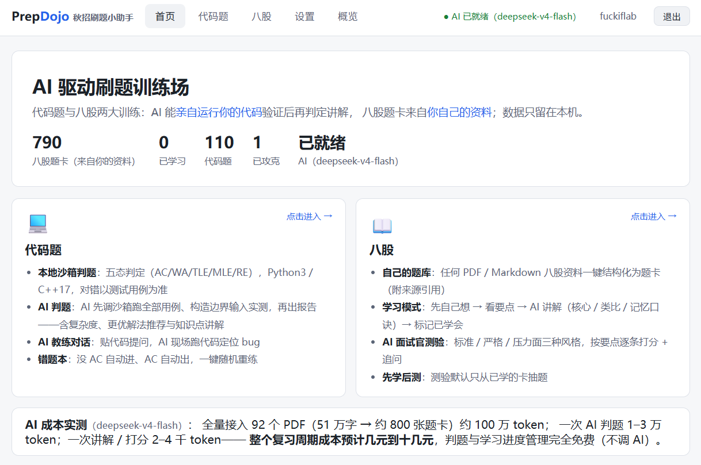

# PrepDojo · 秋招刷题小助手



> **本地优先（local-first）的 AI 驱动刷题工具**：代码题本地沙箱判题，AI 教练可**自主调用判题沙箱**验证代码、讲解思路；八股由 AI 面试官出题、打分、追问；把你自己的知识目录（PDF / Markdown）一键结构化为题卡。


## 为什么是 local-first

- **你的知识库属于你**：八股 PDF、笔记、练习记录全部留在本机 `data/`（已被 `.gitignore` 排除），本仓库**永不包含第三方内容**。
- **判题不依赖任何服务**：本地沙箱执行，断网可用。
- **AI 模块默认使用 DeepSeek 的 OpenAI-compatible API**，也可配置其他兼容端点。

## 快速开始

```bash
git clone https://github.com/yudongfang-thu/PrepDojo.git
cd PrepDojo
python3 -m venv .venv
.venv/bin/python -m pip install --upgrade pip==26.2.1
.venv/bin/python -m pip install -r requirements.txt

# 1) 导入 20 道内置代码题（题面与用例全部自写）
.venv/bin/python -m prepdojo.cli seed

# 2) 启动本地 Web UI
.venv/bin/python -m prepdojo.cli serve
# 打开 http://localhost:8686 —— 判题已可用
```

### 接入你自己的八股知识（可选，需 LLM）

```bash
# 先在 data/config.yaml 填入 api_key（见下），然后：
.venv/bin/python -m prepdojo.cli ingest ~/path/to/你的八股目录
# 不想调 API？先 dry-run 看抽取效果：
.venv/bin/python -m prepdojo.cli ingest ~/path/to/dir --dry-run
```

支持递归扫描 `.pdf`（需文字层；扫描图会提示跳过）/ `.md` / `.txt`，
按文件 SHA-256 增量去重，重复执行只处理新文件。

### LLM 配置（编辑 `data/config.yaml`）

```yaml
llm:
  api_key: "sk-你的key"          # https://platform.deepseek.com 申请
  base_url: "https://api.deepseek.com/v1"
  model: "deepseek-chat"
```

也可用环境变量 `PREPDOJO_API_KEY` 覆盖。（技术上兼容其他 OpenAI 式端点，但未测试、不做保证。）

## 功能

### AI 讲题教练（沙箱即工具）

题目页内置聊天窗口，AI 教练**可以自主调用本地判题沙箱**：

- `run_code`：自己写边界输入，现场跑你的代码看行为；
- `run_problem_case`：把任意代码对全部用例运行，逐用例对比期望输出。
- **AI 判题**（一键）：先强制调沙箱全用例验证 + 构造边界输入实测，再输出结构化报告——判定、复杂度、边界分析、**更优解法推荐**（如两数之和 O(n²)→O(n)）及其**背后知识点讲解**。

AI 看到的是沙箱跑出的真实结果——对错来自事实而非模型猜测；它负责的是讲解、定位 bug、演示与追问。

### 代码题（判题 = 事实，AI = 教练）

- 本地沙箱：`subprocess` + POSIX `rlimit`（CPU / 文件 / 核转储；Linux 另有地址空间与进程数限制）+ wall-clock 超时 + 输出截断。
- 判定五态：**AC / WA / TLE / MLE / RE**（另加编译错误 CE）；AI 教练可通过工具自行运行验证，但权威判定永远来自沙箱与测试用例。
- AI 点评：思路、复杂度、边界条件、面试官可能的追问。
- 语言：Python 3 与 C++ 17（Apple clang 也支持 `#include <bits/stdc++.h>`，见 `prepdojo/cpp_include/`）。
- 内置 20 道种子题（数组/链表/栈队列/二叉树/图/DP/贪心/设计），题面与用例为仓库原创；期望输出由参考解实际运行生成并经双语言交叉验证（`scripts/gen_seeds.py`）。

### 八股陪练（AI 面试官：出题 → 作答 → 打分 → 追问）

- AI 人设：一线大厂资深面试官；三种风格可选——**标准 / 严格 / 压力面**。
- 题卡 schema：问题 / 答案要点 / 追问 / 标签 / 难度 / 来源引用。
- 练习时先不展示答案要点，AI 打分后才给出对照（防偷看）。
- 评分宁可偏严；按要点覆盖度给分并逐条点评；默认排除最近 3 天练过的卡。

### 知识接入流水线（本项目的核心工程点）

```
用户目录（任意结构的 PDF/MD/TXT）
  → 抽取（pypdf；扫描图自动识别并跳过）
  → 分块（Q&A 边界启发式：编号问题 / 问号行 / 滑窗兜底）
  → LLM 结构化（严格字段/类型/长度校验 + 解析失败重试）
  → SQLite（data/prepdojo.db，本地私产）
```

一组内部样本中，92 个文字型 PDF（505 页 / 51 万字符）可抽取为约 790 个 Q&A 块；实际 token 与费用取决于资料和服务商。

## 隐私与版权承诺

1. **分发红线**：仓库只含代码与自写种子内容；`data/` 目录被 `.gitignore` 排除，请勿将第三方题库 / 八股资料提交进来。
2. **API 边界（诚实说明）**：启用 AI 功能后，知识文本、题目、代码、回答和相关对话上下文会发送到你配置的 LLM 服务商。「本地优先」指数据默认不公开分发、不入仓库，不表示 AI 请求不经网络。完全离线需配置本机 OpenAI-compatible 模型服务并确认它不会转发请求。
3. **不搬运题面**：不爬取、不内置 LeetCode / 牛客等平台的题目描述。想练平台原题，请在平台作答后把代码贴回来判题点评（BYO 模式）。

## 项目结构

```
prepdojo/
├── cli.py           # seed / ingest / quiz / serve / stats
├── config.py        # 环境变量 > data/config.yaml > 默认值
├── db.py            # SQLite：题卡 / 代码题 / 提交 / 练习记录
├── extract.py       # PDF/MD 抽取 + Q&A 分块
├── ingest.py        # LLM 结构化流水线（增量 / dry-run）
├── llm.py           # OpenAI 兼容客户端（DeepSeek，含 function calling 与流式）
├── judge.py         # 本地判题沙箱（五态）——同时作为 LLM 的可调用工具
├── chat.py          # AI 讲题教练（沙箱工具循环）
├── review.py        # 代码 AI 点评
├── quiz.py          # 八股打分 / 追问
└── web/             # FastAPI + 无构建静态前端（localhost:8686）
seeds/coding/        # 20 道自写种子题（JSON）
scripts/gen_seeds.py # 种子生成：参考解运行生成期望输出 + 双语言交叉验证
tests/               # pytest（判题五态 / 抽取 / 持久化 / Web API）
legacy/              # 前身项目 AI-Literature-Analyzer（保留存档）
```

## 多用户部署（实验室 / 团队 / 小规模公共访问）

多用户版不是把本地服务改为 `0.0.0.0` 即可。安全部署必须同时具备登录、强制 Docker 判题、用户与全站 AI 配额、HTTPS、Secure Cookie、Host 白名单、私有文件权限和可恢复备份。CLI 会拒绝无 Docker 的多用户模式，也会拒绝无鉴权的非 loopback 监听。

推荐让 PrepDojo 只监听 `127.0.0.1:8686`，由 Caddy 对外提供 HTTPS。完整的配置、systemd、Caddy、备份与恢复步骤见 [多用户 HTTPS 部署手册](deploy/README-server.md)。不要把开发服务器直接暴露到 Internet。

判题镜像从仓库根目录构建：

```bash
docker build -f deploy/Dockerfile.judge -t prepdojo-judge:latest .
```

## 开发

```bash
.venv/bin/python -m pip install -r requirements-dev.txt
.venv/bin/python -m pytest tests/ -q
.venv/bin/python scripts/gen_seeds.py       # 重新生成并验证种子题
```

## License

MIT

---

*PrepDojo 是本仓库前身项目 AI-Literature-Analyzer（AI 文献分析工具）的后继者，旧代码完整保留在 [`legacy/`](legacy/)。*
